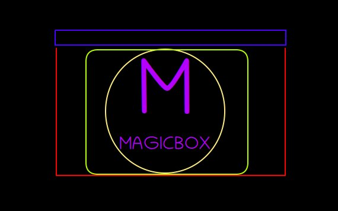

[DE](index.md) - [EN](index_en.md)
## magicBOX

Ich konstruiere eine Essensdose die sich selbs erwärmen und kühlen kann.
Außerdem ist die Dose mit LEDs aussgestattet.
Sie kann mit einem USB–C kabel aufgeleden werden und hält für ca.2Tage

Der Preis soll bei ca. 40–80 EURO liegen.
